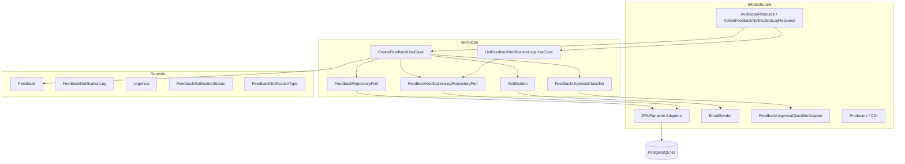
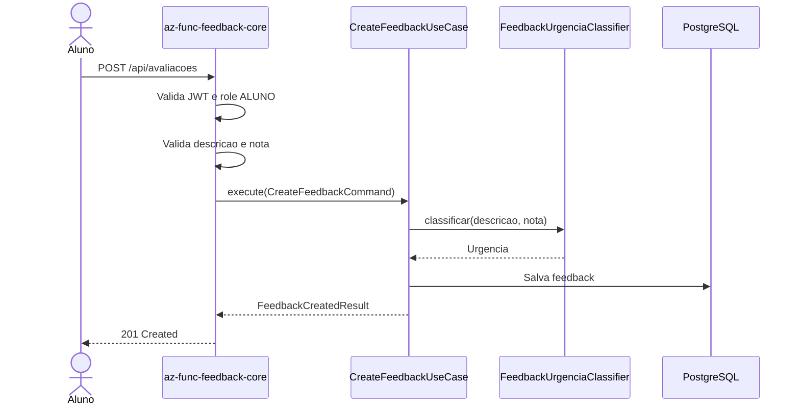
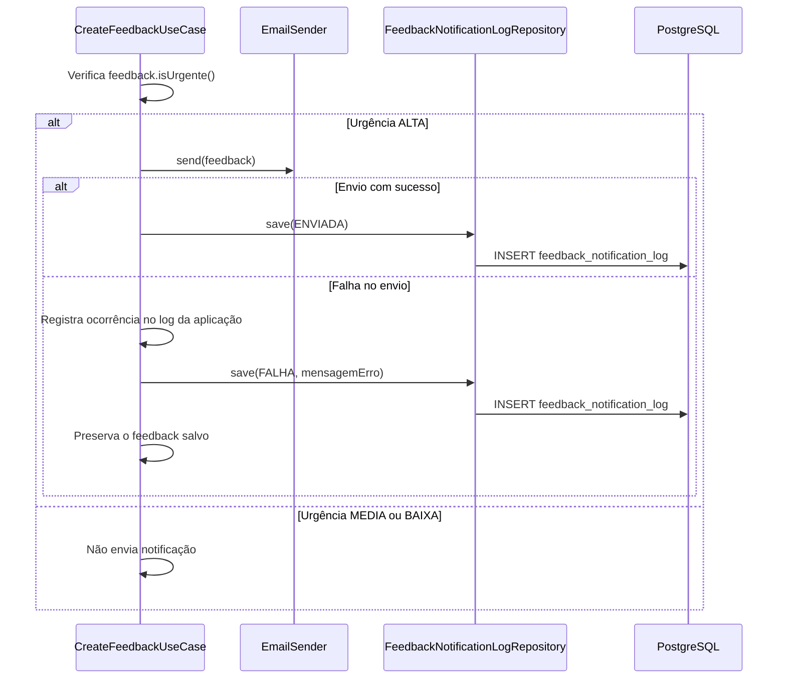
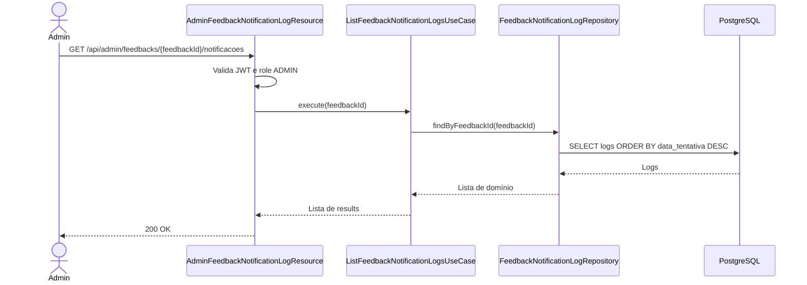
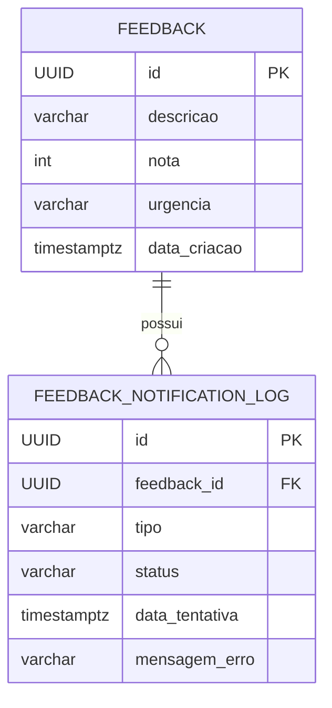

# az-func-feedback-core — Tech Challenge FIAP Fase 4

[](#tecnologias-utilizadas)
[](#tecnologias-utilizadas)
[](#arquitetura-da-solução)
[](#modelo-de-dados)
[](#testes)

## Projeto

**Tech Challenge FIAP — Fase 4**  
**Curso:** Pós-Graduação em Arquitetura e Desenvolvimento em Java  
**Serviço:** `az-func-feedback-core`  
**Tema:** Plataforma serverless para recebimento, classificação, persistência e notificação de feedbacks educacionais.

## Equipe

| Nome | RM | E-mail |
|---|---:|---|
| Alexandre Belisário Duarte Leite de Andrade | RM367163 | alexbdla@gmail.com |
| Kervin Sama Candido da Silva | RM367345 | kervincandido@gmail.com |

## Links do projeto

> TODO: preencher os links finais antes da entrega.

| Item | Link |
|---|---|
| Repositório `az-func-feedback-login` | TODO |
| Repositório `az-func-feedback-core` | TODO |
| Repositório `az-func-feedback-report` | TODO |
| Vídeo de apresentação | TODO |
| Collection Postman/Insomnia | TODO |

---

## Sumário

1. [Visão geral](#visão-geral)
2. [Contexto da Fase 4](#contexto-da-fase-4)
3. [Responsabilidades do core](#responsabilidades-do-core)
4. [Arquitetura da solução](#arquitetura-da-solução)
5. [Arquitetura interna do serviço](#arquitetura-interna-do-serviço)
6. [Fluxos operacionais](#fluxos-operacionais)
7. [Regras de negócio](#regras-de-negócio)
8. [Endpoints da API](#endpoints-da-api)
9. [Modelo de dados](#modelo-de-dados)
10. [Segurança](#segurança)
11. [Configuração](#configuração)
12. [Como executar localmente](#como-executar-localmente)
13. [Deploy](#deploy)
14. [Testes](#testes)
15. [Qualidade técnica](#qualidade-técnica)
16. [Observabilidade](#observabilidade)
17. [Roteiro de demonstração](#roteiro-de-demonstração)
18. [Collections para teste](#collections-para-teste)
19. [Notas sobre Docker, Azurite e escopo do core](#notas-sobre-docker-azurite-e-escopo-do-core)
20. [Troubleshooting](#troubleshooting)
21. [Estrutura de pastas](#estrutura-de-pastas)
22. [Comandos úteis](#comandos-úteis)
23. [TODOs finais para entrega](#todos-finais-para-entrega)
24. [Conclusão](#conclusão)

---

## Visão geral

O `az-func-feedback-core` é o componente responsável pelo fluxo central de avaliações da plataforma de feedbacks da Fase 4 do Tech Challenge.

Ele recebe feedbacks enviados por alunos, valida os dados da requisição, classifica automaticamente a urgência, persiste a avaliação no banco de dados e aciona notificações administrativas quando o conteúdo indica um problema crítico.

A solução foi implementada com **Quarkus**, empacotada para execução como **Azure Function HTTP**, integrada com **PostgreSQL**, **Flyway**, **JWT/RBAC**, **Azure Key Vault** e **Azure Communication Email**.

Além do envio de notificações críticas, o serviço registra o histórico das tentativas de notificação, permitindo rastreabilidade operacional e consulta administrativa posterior.

---

## Contexto da Fase 4

A Fase 4 do Tech Challenge propõe uma solução em nuvem/serverless para apoiar o acompanhamento de feedbacks educacionais, automatizando a identificação de avaliações críticas, a comunicação com responsáveis administrativos e a geração de relatórios consolidados.

A plataforma foi organizada em componentes especializados:

| Componente | Responsabilidade |
|---|---|
| `az-func-feedback-login` | Autenticação e geração de JWT. |
| `az-func-feedback-core` | Recebimento, classificação, persistência e notificação de feedbacks. |
| `az-func-feedback-report` | Geração semanal de relatório consolidado e armazenamento em Blob Storage. |

O `az-func-feedback-core` concentra o fluxo operacional das avaliações: recebe a manifestação do aluno, aplica as regras de classificação, salva o registro, aciona a notificação de feedbacks críticos e mantém rastreabilidade das tentativas de envio.

---

## Responsabilidades do core

O `az-func-feedback-core` é responsável por:

- receber avaliações de alunos;
- validar campos obrigatórios e limites de nota;
- classificar feedbacks em `BAIXA`, `MEDIA` ou `ALTA`;
- persistir feedbacks no banco de dados;
- notificar administradores quando a urgência for `ALTA`;
- proteger o endpoint principal com role `ALUNO`;
- registrar logs das tentativas de notificação;
- permitir consulta administrativa dos logs por role `ADMIN`;
- manter testes automatizados cobrindo domínio, casos de uso, classificação, REST, notificação e persistência.

A autenticação e a emissão dos tokens JWT são realizadas pelo componente `az-func-feedback-login`.

---

## Arquitetura da solução

### Visão macro

```mermaid
flowchart LR
    Aluno[Aluno] -->|Autenticação| Login[az-func-feedback-login]
    Login -->|JWT| Aluno

    Aluno -->|POST /api/avaliacoes| Core[az-func-feedback-core]

    Core -->|Valida e classifica| Core
    Core -->|Persiste feedback| DB[(PostgreSQL)]
    Core -->|Feedback ALTA| Email[Azure Communication Email]
    Core -->|Registra tentativa| DB

    Admin[Administrador] -->|GET /api/admin/feedbacks/{id}/notificacoes| Core

    Report[az-func-feedback-report] -->|Consulta dados consolidados| DB
    Report -->|Gera relatório semanal| Blob[Azure Blob Storage]
```

### Componentes

| Componente | Papel |
|---|---|
| Azure Function HTTP | Entrada serverless do serviço core. |
| Quarkus | Framework de aplicação, REST, CDI, validação, segurança e build. |
| PostgreSQL | Banco principal para feedbacks e logs de notificação. |
| Flyway | Controle versionado de schema. |
| Azure Communication Email | Envio de e-mails para administradores. |
| Azure Key Vault | Fonte segura para segredos em ambiente cloud. |
| JWT/RBAC | Autorização baseada em papéis (`ALUNO`, `ADMIN`). |
| H2 | Banco em memória usado em testes automatizados. |

### Escopo do core

O `az-func-feedback-core` **não gera o relatório semanal** e **não grava arquivos em Blob Storage diretamente**. Essas responsabilidades pertencem ao componente `az-func-feedback-report`.

> TODO: confirmar se alguma dependência ou arquivo auxiliar de Blob Storage permanecerá neste repositório ou será movido para o serviço de relatório/infraestrutura.

---

## Arquitetura interna do serviço

O core foi estruturado seguindo princípios de **Clean Architecture / Ports and Adapters**, separando domínio, casos de uso, portas e adaptadores de infraestrutura.



### Camadas

| Camada | Responsabilidade | Exemplos |
|---|---|---|
| `domain` | Modelo de negócio e invariantes. | `Feedback`, `FeedbackNotificationLog`, `Urgencia`. |
| `application` | Casos de uso, DTOs e portas. | `CreateFeedbackUseCase`, `ListFeedbackNotificationLogsUseCase`. |
| `infrastructure` | REST, JPA, e-mail, classificação, CDI. | `AvaliacaoResource`, `EmailSender`, repositories Panache. |
| `resources` | Configuração e migrations. | `application.properties`, `db/migration`. |
| `test` | Testes unitários e de integração. | `AvaliacaoResourceTest`, `CreateFeedbackUseCaseTest`. |

---

## Fluxos operacionais

### 1. Fluxo de criação de avaliação



### 2. Fluxo de notificação crítica



### 3. Fluxo de consulta administrativa dos logs



---

## Regras de negócio

### Validação do feedback

O domínio `Feedback` exige:

| Campo | Regra |
|---|---|
| `id` | Obrigatório. |
| `descricao` | Obrigatória e não pode ser vazia. |
| `nota` | Deve estar entre `0` e `10`. |
| `urgencia` | Obrigatória. |
| `dataCriacao` | Obrigatória. |

A camada REST também valida o payload recebido pela API:

| Campo | Regra na API |
|---|---|
| `descricao` | Obrigatória, não vazia, entre 3 e 2000 caracteres. |
| `nota` | Obrigatória, entre 0 e 10. |

### Classificação de urgência

A urgência é calculada com base na nota e em palavras críticas presentes na descrição.

| Condição | Urgência |
|---|---|
| `nota <= 3` | `ALTA` |
| Descrição contém palavra crítica | `ALTA` |
| `nota <= 6` | `MEDIA` |
| Demais casos | `BAIXA` |

Palavras críticas consideradas:

```text
erro
travando
bug
pessimo
pessima
horrivel
nao funciona
reclamacao
insuportavel
```

A busca por palavra crítica normaliza caixa e acentos. Assim, descrições como `péssima`, `PESSIMA` ou `pessima` são tratadas de forma equivalente.

### Notificação

Quando o feedback é classificado como `ALTA`, o core envia uma notificação por e-mail aos administradores configurados.

O fluxo de notificação foi implementado com tolerância a falhas operacionais:

- se o e-mail for enviado com sucesso, registra log `ENVIADA`;
- se o envio falhar, registra log `FALHA`;
- o feedback permanece persistido como registro principal da avaliação;
- o histórico de tentativas fica disponível para consulta administrativa.

### Normalização dos e-mails administrativos

O `EmailSender` aceita múltiplos destinatários em `app.admin-emails` usando `;` ou `,` como separadores.

Exemplo:

```properties
app.admin-emails=admin1@email.com; admin2@email.com, admin3@email.com
```

O parsing:

- aplica `trim`;
- remove entradas vazias;
- remove duplicados;
- valida a existência de pelo menos um destinatário.

### Segurança do HTML do e-mail

A descrição do feedback é escapada antes de ser inserida no corpo HTML do e-mail. Isso evita que caracteres como `<`, `>`, `"`, `'` e `&` sejam interpretados como marcação HTML.

---

## Endpoints da API

O projeto está documentado considerando o seguinte root path:

```properties
quarkus.http.root-path=api
```

Portanto, em execução local, os endpoints ficam sob `/api`.

> TODO: confirmar antes da entrega se `quarkus.http.root-path=api` permanece no `src/main/resources/application.properties`. Caso seja removido, ajustar os exemplos para `/avaliacoes` e `/admin/feedbacks/{feedbackId}/notificacoes`.

### Tabela de endpoints

| Método | Endpoint | Role | Descrição |
|---|---|---|---|
| `POST` | `/api/avaliacoes` | `ALUNO` | Cria uma avaliação/feedback. |
| `GET` | `/api/admin/feedbacks/{feedbackId}/notificacoes` | `ADMIN` | Lista logs de notificação de um feedback. |

### 1. Criar avaliação

```http
POST /api/avaliacoes
Authorization: Bearer <TOKEN_ALUNO>
Content-Type: application/json
```

#### Request — avaliação baixa

```json
{
  "descricao": "A aula foi muito boa",
  "nota": 9
}
```

#### Response — 201 Created

```json
{
  "id": "a7f3ffb1-2564-4661-9767-6ccaf87bbdfa",
  "descricao": "A aula foi muito boa",
  "nota": 9,
  "urgencia": "BAIXA",
  "dataCriacao": "2026-05-16T21:26:47.551857200-03:00"
}
```

#### Request — avaliação crítica

```json
{
  "descricao": "A plataforma está travando durante a aula",
  "nota": 8
}
```

#### Response — 201 Created

```json
{
  "id": "b3a3d6ba-c234-47b9-af77-ec35ad0bf6fe",
  "descricao": "A plataforma está travando durante a aula",
  "nota": 8,
  "urgencia": "ALTA",
  "dataCriacao": "2026-05-16T21:26:47.669058900-03:00"
}
```

Nesse exemplo, mesmo com nota `8`, a urgência é `ALTA` porque a descrição contém a palavra crítica `travando`.

#### Possíveis respostas

| Status | Cenário |
|---:|---|
| `201` | Feedback criado com sucesso. |
| `400` | Payload inválido, nota fora do intervalo ou descrição vazia. |
| `401` | Usuário não autenticado. |
| `403` | Usuário autenticado sem role `ALUNO`. |

### 2. Consultar logs de notificação

```http
GET /api/admin/feedbacks/{feedbackId}/notificacoes
Authorization: Bearer <TOKEN_ADMIN>
Accept: application/json
```

#### Response — 200 OK

```json
[
  {
    "id": "c4da9f6b-83c8-44a8-b6e4-61e3fc517ff0",
    "feedbackId": "b3a3d6ba-c234-47b9-af77-ec35ad0bf6fe",
    "tipo": "EMAIL",
    "status": "ENVIADA",
    "dataTentativa": "2026-05-16T21:26:47.670000Z",
    "mensagemErro": null
  }
]
```

#### Response — log de falha

```json
[
  {
    "id": "2f14e6ce-f6ab-476a-96e1-e9fc104e8ee6",
    "feedbackId": "b3a3d6ba-c234-47b9-af77-ec35ad0bf6fe",
    "tipo": "EMAIL",
    "status": "FALHA",
    "dataTentativa": "2026-05-16T21:26:47.670000Z",
    "mensagemErro": "Timeout ao enviar e-mail"
  }
]
```

> Observação: o offset de `dataTentativa` pode variar conforme o ambiente de execução. Em Azure, é comum que horários sejam registrados em UTC.

#### Possíveis respostas

| Status | Cenário |
|---:|---|
| `200` | Lista retornada com sucesso. |
| `200` | Lista vazia quando não houver logs para o feedback. |
| `401` | Usuário não autenticado. |
| `403` | Usuário autenticado sem role `ADMIN`. |

---

## Modelo de dados

### Diagrama ER



### Tabela `feedback`

Armazena as avaliações recebidas.

| Campo | Tipo | Restrição | Descrição |
|---|---|---|---|
| `id` | `UUID` | PK | Identificador do feedback. |
| `descricao` | `VARCHAR(2000)` | NOT NULL | Texto informado pelo aluno. |
| `nota` | `INTEGER` | NOT NULL, `0 <= nota <= 10` | Nota da avaliação. |
| `urgencia` | `VARCHAR(20)` | `BAIXA`, `MEDIA`, `ALTA` | Classificação calculada. |
| `data_criacao` | `TIMESTAMP WITH TIME ZONE` | NOT NULL | Data de criação. |

Índices:

- `idx_feedback_data_criacao`;
- `idx_feedback_urgencia`.

### Tabela `feedback_notification_log`

Armazena as tentativas de notificação associadas a feedbacks críticos.

| Campo | Tipo | Restrição | Descrição |
|---|---|---|---|
| `id` | `UUID` | PK | Identificador do log. |
| `feedback_id` | `UUID` | FK para `feedback(id)` | Feedback relacionado. |
| `tipo` | `VARCHAR(50)` | `EMAIL` | Tipo de notificação. |
| `status` | `VARCHAR(20)` | `ENVIADA`, `FALHA` | Resultado da tentativa. |
| `data_tentativa` | `TIMESTAMP WITH TIME ZONE` | NOT NULL | Data da tentativa. |
| `mensagem_erro` | `VARCHAR(2000)` | NULL | Mensagem de erro quando houver falha. |

Índices:

- `idx_feedback_notification_log_feedback_id`;
- `idx_feedback_notification_log_status`;
- `idx_feedback_notification_log_data_tentativa`.

---

## Segurança

O core usa **JWT** e controle de acesso por roles.

| Endpoint | Role exigida |
|---|---|
| `POST /api/avaliacoes` | `ALUNO` |
| `GET /api/admin/feedbacks/{feedbackId}/notificacoes` | `ADMIN` |

### JWT

O serviço valida:

- issuer configurado;
- chave pública configurada;
- roles presentes no token.

Exemplo conceitual de configuração:

```properties
mp.jwt.verify.issuer=https://feedback-login.com.br/issuer
mp.jwt.verify.publickey=<chave-publica-ou-referencia-segura>
```

> TODO: substituir o exemplo acima pelo nome real do secret ou pela configuração definitiva usada no Azure/Key Vault.

### Separação de responsabilidade

O core consome tokens JWT emitidos pelo componente `az-func-feedback-login`.

---

## Configuração

### Arquivo principal

O arquivo principal fica em:

```text
src/main/resources/application.properties
```

### Propriedades e origens esperadas

O projeto usa propriedades do Quarkus, variáveis de ambiente e Azure Key Vault para externalizar configurações sensíveis.

| Propriedade da aplicação | Origem esperada | Descrição |
|---|---|---|
| `quarkus.azure.keyvault.secret.endpoint` | `QUARKUS_AZURE_KEYVAULT_SECRET_ENDPOINT` | Endpoint do Azure Key Vault. |
| `quarkus.http.root-path` | `application.properties` | Prefixo base da API. Valor esperado: `api`. |
| `quarkus.datasource.db-kind` | `QUARKUS_DB_KIND` ou valor configurado no projeto | Tipo do banco. Em produção: PostgreSQL. |
| `quarkus.datasource.jdbc.url` | Key Vault / variável de ambiente | URL JDBC do PostgreSQL. |
| `quarkus.datasource.username` | Key Vault / variável de ambiente | Usuário do banco. |
| `quarkus.datasource.password` | Key Vault / variável de ambiente | Senha do banco. |
| `app.email.connection-string` | Key Vault / variável de ambiente | Connection string do Azure Communication Email. |
| `app.admin-emails` | Key Vault / variável de ambiente | Lista de e-mails administrativos. |
| `app.email.sender-address` | Key Vault / variável de ambiente | Endereço remetente autorizado no Azure Communication Email. |
| `app.email.subject` | `EMAIL_SUBJECT` ou valor padrão | Assunto do e-mail de alerta. |
| `mp.jwt.verify.issuer` | configuração da aplicação | Emissor esperado do token JWT. |
| `mp.jwt.verify.publickey` | Key Vault / variável / arquivo seguro | Chave pública para validação do JWT. |

> TODO: confirmar e documentar os nomes finais dos secrets usados no Azure Key Vault.

### Sugestão de nomes de secrets

Abaixo estão nomes esperados/sugeridos para os secrets, a confirmar conforme o ambiente final:

| Secret | Descrição |
|---|---|
| `FeedBackDBUrl` | URL JDBC do PostgreSQL. |
| `FeedbackDBUser` | Usuário do banco. |
| `FeedBackDBPassword` | Senha do banco. |
| `FeedbackDBEmailConnectionString` | Connection string do Azure Communication Email. |
| `FeedbackAdminEmailList` | Lista de e-mails administrativos. |
| `FeedbackEmailSenderAddress` | E-mail remetente autorizado. |
| `jwt-public-key` | Chave pública para validação dos tokens. TODO: confirmar nome real. |

### Configuração sensível

Valores sensíveis não devem ser versionados no Git.

Em produção, banco, e-mail e chave pública JWT devem vir de:

1. variáveis de ambiente da Function App; ou
2. Azure Key Vault.

Em testes automatizados, o projeto usa H2 e valores mockados para e-mail/JWT.

### Perfil de teste

Exemplo conceitual de configuração de teste:

```properties
quarkus.datasource.db-kind=h2
quarkus.datasource.jdbc.url=jdbc:h2:mem:feedback_test;MODE=PostgreSQL;DATABASE_TO_LOWER=TRUE;DEFAULT_NULL_ORDERING=HIGH;DB_CLOSE_DELAY=-1
quarkus.datasource.username=sa
quarkus.datasource.password=sa

app.email.connection-string=endpoint=https://localhost;accesskey=mock
app.admin-emails=test@example.com
app.email.sender-address=test@example.com
app.email.subject=Feedback Test

mp.jwt.verify.issuer=https://feedback-login.com.br/issuer
mp.jwt.verify.publickey=mock-key
```

---

## Tecnologias utilizadas

| Categoria | Tecnologia |
|---|---|
| Linguagem | Java 25 |
| Framework | Quarkus 3.34.6 |
| Serverless | Azure Functions HTTP |
| Persistência | Hibernate ORM Panache |
| Banco principal | PostgreSQL |
| Banco de testes | H2 |
| Migração | Flyway |
| Segurança | JWT, RBAC, `@RolesAllowed` |
| Segredos | Azure Key Vault |
| E-mail | Azure Communication Email |
| Observabilidade | Micrometer, OpenTelemetry |
| Testes | JUnit 5, RestAssured, Quarkus Test |
| Build | Maven |
| Empacotamento | Azure Functions Maven Plugin |

---

## Como executar localmente

### Pré-requisitos

- Java 25;
- Maven 3.9+;
- Azure Functions Core Tools, caso queira executar como Function local;
- PostgreSQL, caso execute contra banco real;
- variáveis de ambiente configuradas ou perfil de desenvolvimento/teste com H2.

### Clonar o repositório

```powershell
git clone TODO
cd az-func-feedback-core
```

> TODO: substituir `TODO` pela URL real do repositório.

### Rodar em modo Quarkus dev

```powershell
mvn quarkus:dev
```

A API ficará disponível em:

```text
http://localhost:8080/api
```

Exemplo:

```text
http://localhost:8080/api/avaliacoes
```

> TODO: confirmar se a execução local em `quarkus:dev` será demonstrada com H2, PostgreSQL local ou banco cloud.

### Rodar como Azure Function local

Empacote o projeto:

```powershell
mvn clean package
```

Depois, acesse o diretório gerado:

```powershell
cd target\azure-functions\func-feedback-core
func host start
```

> TODO: confirmar se o comando `func host start` será executado na porta padrão ou com porta customizada no roteiro de demonstração.

---

## Deploy

O projeto é empacotado como **Azure Function HTTP** por meio do **Azure Functions Maven Plugin**.

### Build para deploy

```powershell
mvn clean package
```

Após o build, os artefatos da Function são gerados em:

```text
target/azure-functions/func-feedback-core
```

### Configurações necessárias no Azure

A Function App precisa ter acesso às configurações de banco, JWT, e-mail e Key Vault por meio de **App Settings** e/ou **Azure Key Vault**.

Configurações esperadas:

- endpoint do Azure Key Vault;
- URL JDBC do PostgreSQL;
- usuário e senha do banco;
- connection string do Azure Communication Email;
- e-mail remetente autorizado;
- lista de e-mails administrativos;
- issuer JWT;
- chave pública JWT.

### Deploy automatizado

O deploy pode ser realizado via GitHub Actions, executando o build Maven e publicando o pacote gerado para a Function App `func-feedback-core`.

> TODO: inserir o nome definitivo da Function App, o nome do workflow e os secrets configurados no GitHub Actions.

### Checklist mínimo de deploy

- [ ] Function App criada no Azure.
- [ ] App Settings configurados.
- [ ] Key Vault configurado.
- [ ] Permissão da Function App para ler secrets do Key Vault.
- [ ] Banco PostgreSQL acessível pela Function App.
- [ ] Azure Communication Email configurado com remetente autorizado.
- [ ] Chave pública JWT configurada.
- [ ] GitHub Actions configurado para deploy automatizado.
- [ ] Teste do endpoint `/api/avaliacoes` em ambiente cloud.
- [ ] Teste do endpoint `/api/admin/feedbacks/{feedbackId}/notificacoes` em ambiente cloud.

---

## Testes

### Rodar todos os testes

```powershell
mvn test
```

### Rodar build completo

```powershell
mvn clean package
```

### Rodar testes específicos

```powershell
mvn -Dtest=AvaliacaoResourceTest test
```

```powershell
mvn -Dtest=CreateFeedbackUseCaseTest test
```

```powershell
mvn -Dtest=AdminFeedbackNotificationLogResourceTest test
```

```powershell
mvn -Dtest=EmailSenderTest test
```

### Última validação local registrada

```text
Tests run: 55
Failures: 0
Errors: 0
Skipped: 0
BUILD SUCCESS
```

> TODO: atualizar este número caso novos testes sejam adicionados antes da entrega.

---

## Qualidade técnica

### Clean Architecture / Ports and Adapters

O projeto mantém as regras de negócio isoladas dos detalhes técnicos:

- use cases dependem de interfaces;
- adapters JPA implementam portas de persistência;
- envio de e-mail é tratado por porta genérica `Notification<T>`;
- classificação de urgência é exposta por `FeedbackUrgenciaClassifier`;
- resources REST recebem requests, delegam para use cases e montam responses.

### SOLID

| Princípio | Aplicação no projeto |
|---|---|
| SRP | `CreateFeedbackUseCase` orquestra criação; `EmailSender` envia e-mail; repositories persistem dados. |
| OCP | Novos tipos de notificação podem ser adicionados implementando `Notification<Feedback>`. |
| LSP | Adapters implementam portas sem alterar contratos da aplicação. |
| ISP | Portas pequenas e específicas, como `FeedbackRepositoryPort` e `FeedbackNotificationLogRepositoryPort`. |
| DIP | Casos de uso dependem de abstrações, não de implementações concretas. |

### Resiliência operacional

A criação do feedback prioriza o registro da avaliação como dado principal do domínio. A notificação administrativa é tratada como ação operacional complementar, com registro próprio de sucesso ou falha.

```text
Receber feedback → Classificar → Persistir → Notificar se crítico → Registrar tentativa
```

Esse desenho garante rastreabilidade do fluxo sem impedir o recebimento da avaliação caso ocorra uma falha momentânea no provedor de e-mail ou no registro do log de notificação.

### Segurança

- endpoints protegidos por role;
- JWT validado por issuer e chave pública;
- valores sensíveis externalizados via variáveis de ambiente ou Azure Key Vault;
- perfis de teste usando H2 e valores mockados;
- escape de conteúdo dinâmico no HTML do e-mail.

### Testabilidade

O projeto cobre:

- validações do domínio `Feedback`;
- validações do domínio `FeedbackNotificationLog`;
- classificação de urgência;
- criação do feedback;
- envio de notificações;
- registro de logs `ENVIADA` e `FALHA`;
- parsing de e-mails administrativos;
- escape HTML;
- consulta administrativa dos logs;
- autorização `ALUNO`, `ADMIN`, `401` e `403`.

---

## Observabilidade

O projeto possui integração com Micrometer/OpenTelemetry.

Há instrumentação com `@Counted` e `@Timed` em pontos relevantes do fluxo.

Métricas instrumentadas no código:

- `criacoes.avaliacoes`;
- `criacao.avaliacao.time`;
- `feedback.repository.save`;
- `feedback.repository.findById`;
- `feedback.notification.log.repository.save`;
- `feedback.notification.log.repository.findByFeedbackId`.

O prefixo padrão das métricas é:

```properties
feedback.metrics.prefix=feedback.core.
```

A exportação para Azure/Application Insights depende das configurações da Function App e do ambiente de execução.

> TODO: documentar a configuração final de Application Insights/OpenTelemetry usada no ambiente cloud.

---

## Roteiro de demonstração

### Cenário 1 — Avaliação não crítica

1. Obter token JWT com role `ALUNO`.
2. Enviar:

```http
POST /api/avaliacoes
```

```json
{
  "descricao": "A aula foi muito boa",
  "nota": 9
}
```

3. Verificar response com `urgencia = BAIXA`.
4. Explicar que feedbacks `BAIXA` não geram notificação administrativa.

### Cenário 2 — Avaliação crítica por nota

1. Obter token JWT com role `ALUNO`.
2. Enviar:

```json
{
  "descricao": "Não consegui acompanhar a aula",
  "nota": 2
}
```

3. Verificar response com `urgencia = ALTA`.
4. Verificar a tentativa de notificação registrada no banco.

### Cenário 3 — Avaliação crítica por palavra-chave

1. Enviar:

```json
{
  "descricao": "A plataforma está travando durante a aula",
  "nota": 8
}
```

2. Verificar `urgencia = ALTA`, mesmo com nota alta.
3. Explicar que a palavra `travando` é crítica.

### Cenário 4 — Consulta administrativa do histórico

1. Obter token JWT com role `ADMIN`.
2. Consultar:

```http
GET /api/admin/feedbacks/{feedbackId}/notificacoes
```

3. Mostrar retorno contendo `EMAIL`, `ENVIADA` ou `FALHA`.

### Cenário 5 — Segurança

1. Tentar criar avaliação sem token.
2. Mostrar `401`.
3. Tentar criar avaliação com role diferente de `ALUNO`.
4. Mostrar `403`.
5. Tentar consultar logs com role `ALUNO`.
6. Mostrar `403`.

---

## Collections para teste

Sugestão de organização:

```text
postman/
  Feedback Platform - Core.postman_collection.json
  Feedback Platform - Local.postman_environment.json
```

Sugestão de cenários:

1. Login como aluno.
2. Criar feedback `BAIXA`.
3. Criar feedback `MEDIA`.
4. Criar feedback `ALTA` por nota.
5. Criar feedback `ALTA` por palavra crítica.
6. Login como admin.
7. Consultar logs de notificação.
8. Validar 401 sem token.
9. Validar 403 com role incorreta.

> TODO: adicionar a collection real ao repositório ou remover esta seção caso a equipe opte por demonstrar apenas via cURL/PowerShell/Postman local.

---

## Notas sobre Docker, Azurite e escopo do core

O deploy principal deste serviço é via **Azure Functions Maven Plugin**, não via imagem Docker.

Os Dockerfiles gerados pelo Quarkus estão em `src/main/docker`, mas devem ser tratados como artefatos auxiliares. Como o projeto usa Java 25, qualquer execução via Docker JVM deve garantir runtime compatível com Java 25.

> TODO: atualizar/remover Dockerfiles que usem runtime Java 21 caso a equipe decida manter execução via Docker.

Caso exista `docker-compose.yml` com Azurite neste repositório, ele deve ser interpretado como recurso auxiliar de desenvolvimento. O fluxo principal do `az-func-feedback-core` não utiliza Blob Storage diretamente; o Blob Storage pertence ao componente de relatório.

> TODO: decidir se o `docker-compose.yml` com Azurite permanece neste repositório, migra para `az-func-feedback-report` ou fica em um repositório/pasta de infraestrutura.

---

## Troubleshooting

### Erro no GitHub Actions: `azure/login@v3`

Se aparecer:

```text
Not all values are present. Ensure 'client-id' and 'tenant-id' are supplied.
```

Verifique os secrets do repositório:

- `AZURE_CREDENTIALS`; ou
- `AZURE_CLIENT_ID`;
- `AZURE_TENANT_ID`;
- `AZURE_SUBSCRIPTION_ID`;
- `AZURE_CLIENT_SECRET`, se estiver usando Service Principal com secret.

> TODO: ajustar esta seção conforme o modelo real de autenticação usado no workflow.

### Testes falhando por FK entre `feedback_notification_log` e `feedback`

A tabela `feedback_notification_log` possui FK para `feedback`. Em testes de limpeza de banco, a ordem correta é:

```java
notificationLogRepository.deleteAll();
feedbackRepository.deleteAll();
```

### Caracteres acentuados aparecem como `?` no console

Isso geralmente está ligado ao encoding do terminal no Windows. O projeto usa UTF-8, mas o terminal pode não estar renderizando corretamente.

Possível ajuste:

```powershell
chcp 65001
```

### Warning sobre `sun.misc.Unsafe`

Com Java 25, algumas dependências do ecossistema Maven/Guice podem emitir warning de uso de APIs depreciadas. Esse warning não impede o build.

### Warning do Flyway com H2

O Flyway pode avisar que a versão do H2 é mais nova do que a última verificada. Esse warning não impede a execução dos testes.

---

## Estrutura de pastas

Estrutura simplificada:

```text
src/
  main/
    java/
      br/com/fiap/techchallenge/feedbackplatform/
        application/
          dto/
          ports/
          usecase/
        domain/
          enums/
          model/
        infrastructure/
          classifier/
          config/
          notify/
          persistence/
          rest/
    resources/
      application.properties
      db/migration/
  test/
    java/
      br/com/fiap/techchallenge/feedbackplatform/
        application/
        domain/
        infrastructure/
    resources/
      application.properties
```

---

## Comandos úteis

### Build

```powershell
mvn clean package
```

### Testes

```powershell
mvn clean test
```

### Rodar Quarkus dev

```powershell
mvn quarkus:dev
```

### Rodar Azure Function local

```powershell
mvn clean package
cd target\azure-functions\func-feedback-core
func host start
```

### Criar branch

```powershell
git checkout main
git pull origin main
git checkout -b docs/atualiza-readme-core
```

---

## TODOs finais para entrega

Antes da entrega final, revisar:

- [ ] Preencher links reais dos repositórios.
- [ ] Inserir link do vídeo de apresentação.
- [ ] Inserir ou remover referência à collection Postman/Insomnia.
- [ ] Confirmar `quarkus.http.root-path=api`.
- [ ] Confirmar nomes reais dos secrets no Azure Key Vault.
- [ ] Confirmar configuração real de JWT no core.
- [ ] Documentar workflow real de deploy no GitHub Actions.
- [ ] Documentar configuração final de observabilidade/Application Insights.
- [ ] Confirmar se `docker-compose.yml` com Azurite permanece no core.
- [ ] Confirmar se dependências relacionadas a Blob Storage permanecem no core ou migram para o report.
- [ ] Atualizar número de testes caso a suíte mude.

---

## Conclusão

O `az-func-feedback-core` entrega o fluxo principal de feedbacks da Fase 4 com foco em simplicidade, segurança, rastreabilidade e aderência a uma arquitetura em camadas.

A solução permite que alunos enviem avaliações, classifica automaticamente a urgência, persiste os dados, dispara notificações administrativas em casos críticos e registra o histórico das tentativas de envio.

A consulta administrativa dos logs torna o comportamento demonstrável e facilita auditoria técnica da solução.

Este README é uma documentação viva. Em caso de evolução da API, das configurações ou dos componentes Azure, recomenda-se atualizá-lo junto com o código.
