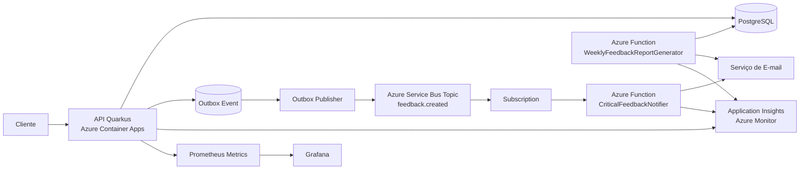

# Plataforma de Feedback para Aulas Online

## Visão geral

Este projeto implementa uma **plataforma de feedback para aulas e cursos online**, permitindo que estudantes enviem avaliações, que feedbacks críticos sejam identificados automaticamente e que administradores recebam alertas e relatórios semanais consolidados.

A solução será construída em **Microsoft Azure**, com uso de **serverless**, arquitetura baseada em **Clean Architecture**, e foco em **Clean Code**, **baixo acoplamento**, **observabilidade**, **confiabilidade operacional** e **facilidade de evolução**.

---

## Objetivos do sistema

- receber avaliações de estudantes
- classificar automaticamente a urgência dos feedbacks
- enviar alertas automáticos para situações críticas
- gerar relatório semanal com métricas consolidadas
- manter rastreabilidade, monitoramento e integridade operacional

---

## Escopo do MVP

### Incluído
- criação de feedback
- validação de entrada
- classificação de urgência
- persistência em banco relacional
- gravação de evento em outbox
- publicação assíncrona do evento `feedback.created`
- envio de alerta automático para feedback crítico
- geração de relatório semanal por e-mail
- observabilidade da API e das Azure Functions
- pipeline automatizado de build, testes e deploy

### Fora do escopo
- dashboard administrativo web
- autenticação completa com usuários
- edição e exclusão de feedback
- coleta de dados pessoais do estudante
- analytics avançada
- múltiplos perfis administrativos persistidos em banco

---

## Arquitetura da solução

### Componentes principais
- **API principal:** Quarkus
- **Hospedagem da API:** Azure Container Apps
- **Banco de dados:** Azure Database for PostgreSQL
- **Mensageria:** Azure Service Bus Topic + Subscription
- **Funções serverless:** Azure Functions
- **Confiabilidade de publicação:** Transactional Outbox
- **Observabilidade principal:** Azure Monitor + Application Insights
- **Dashboards e métricas:** Prometheus + Grafana
- **CI/CD:** GitHub Actions
- **Segurança:** Managed Identity + Azure Key Vault

### Visão arquitetural simplificada



---

## Premissas funcionais

### Regra de urgência

#### ALTA
- nota entre **0 e 3**
- ou presença de palavras-chave críticas na descrição

#### MEDIA
- nota entre **4 e 6**

#### BAIXA
- nota entre **7 e 10**

### Palavras críticas iniciais
- erro
- travando
- bug
- péssimo
- horrível
- não funciona
- reclamação
- insuportável

### Administradores
Os administradores serão definidos por configuração, por exemplo:

```env
ADMIN_EMAILS=admin1@empresa.com,admin2@empresa.com
```

### Privacidade
No MVP, não serão coletados dados pessoais do estudante.

### Relatório semanal
O relatório será enviado por **e-mail em HTML**, contendo:
- média das avaliações
- quantidade de avaliações por dia
- quantidade de avaliações por urgência
- resumo dos feedbacks do período

---

## Fluxos principais

### 1. Recebimento de feedback
1. O cliente envia um feedback para a API.
2. A API valida a entrada.
3. A API classifica a urgência.
4. O feedback é persistido no PostgreSQL.
5. Um evento é gravado na tabela de outbox.
6. Um publicador assíncrono envia o evento para o tópico `feedback.created`.
7. A Function `CriticalFeedbackNotifier` consome a subscription.
8. Se a urgência for alta, um alerta é enviado aos administradores.

### 2. Relatório semanal
1. A Function `WeeklyFeedbackReportGenerator` é acionada por agendamento.
2. Ela consulta os feedbacks do período semanal.
3. Calcula as métricas consolidadas.
4. Gera o relatório em HTML.
5. Envia o relatório aos administradores.

---

## API inicial

### Endpoint principal
`POST /avaliacoes`

### Exemplo de requisição

```json
{
  "descricao": "A aula foi boa, mas o áudio estava ruim",
  "nota": 5
}
```

### Exemplo de resposta

```json
{
  "id": "uuid",
  "descricao": "A aula foi boa, mas o áudio estava ruim",
  "nota": 5,
  "urgencia": "MEDIA",
  "dataCriacao": "2026-04-21T10:30:00-03:00"
}
```

### Regras de validação
- `descricao` obrigatória
- `descricao` com tamanho mínimo e máximo configurados
- `nota` obrigatória
- `nota` entre 0 e 10

---

## Estrutura técnica do projeto

```text
src/main/java
  ├── domain
  │   ├── model
  │   ├── enums
  │   ├── services
  │   └── rules
  ├── application
  │   ├── usecase
  │   ├── dto
  │   ├── ports
  │   └── mapper
  ├── infrastructure
  │   ├── persistence
  │   ├── messaging
  │   ├── outbox
  │   ├── email
  │   ├── monitoring
  │   └── config
  └── entrypoint
      └── rest
```

### Diretrizes de implementação
- controllers finos
- regras de negócio concentradas no domínio e na aplicação
- portas apontando para dentro
- adapters implementando dependências externas
- testes unitários e de integração desde o início
- foco em coesão, clareza e evolução segura

---

## Modelo de dados inicial

### Entidade `Feedback`
Campos principais:
- `id`
- `descricao`
- `nota`
- `urgencia`
- `dataCriacao`
- `alertaEnviado`
- `dataEnvioAlerta`
- `statusProcessamento`

### Entidade `OutboxEvent`
Campos sugeridos:
- `id`
- `aggregateId`
- `eventType`
- `payload`
- `status`
- `createdAt`
- `publishedAt`
- `retryCount`

### Enum `Urgencia`
- `BAIXA`
- `MEDIA`
- `ALTA`

---

## Observabilidade

### Base principal
- Azure Monitor
- Application Insights

### Responsabilidades
- logs
- traces
- exceptions
- latência
- disponibilidade operacional
- correlação entre API, publicação e Functions

### Camada complementar
- Prometheus
- Grafana

### Métricas esperadas

#### Técnicas
- total de requisições
- tempo médio de resposta
- taxa de erro
- health checks
- consumo de memória
- tempo de processamento de eventos

#### De negócio
- total de feedbacks recebidos
- quantidade por urgência
- total de alertas enviados
- média semanal de notas
- quantidade de feedbacks por dia

---

## Segurança

### Estratégia do MVP
- sem sistema completo de login
- proteção simples e defensável
- menor privilégio
- segredos fora do código

### Medidas práticas
- `Managed Identity` quando possível
- `Azure Key Vault` para segredos
- API Key para endpoints administrativos, se existirem
- logs sem dados sensíveis
- acesso restrito aos recursos da Azure

---

## CI/CD

### Pipeline
O projeto utilizará **GitHub Actions** para:
- build
- testes
- empacotamento
- build da imagem da API
- deploy no Azure Container Apps
- deploy das Azure Functions

---

## Execução local

> Esta seção parte do princípio de que a implementação ainda será construída. Os comandos abaixo representam o alvo do repositório.

### Pré-requisitos
- Java 21
- Maven 3.9+
- Docker e Docker Compose
- PostgreSQL local ou via container
- acesso a recursos Azure para testes integrados

### Variáveis de ambiente esperadas

```env
APP_DB_URL=jdbc:postgresql://localhost:5432/feedbackdb
APP_DB_USERNAME=postgres
APP_DB_PASSWORD=postgres
APP_ADMIN_EMAILS=admin1@empresa.com,admin2@empresa.com
APP_SERVICEBUS_TOPIC_NAME=feedback.created
APP_KEY_VAULT_ENABLED=false
```

### Subir a API localmente

```bash
./mvnw quarkus:dev
```

### Executar testes

```bash
./mvnw test
```

### Build da aplicação

```bash
./mvnw clean package
```

---

## Roadmap resumido

1. fundação do projeto e estrutura arquitetural
2. modelagem de domínio e persistência
3. endpoint `POST /avaliacoes`
4. outbox e publicação de eventos
5. função de alerta crítico
6. função de relatório semanal
7. observabilidade
8. segurança e configuração
9. CI/CD
10. documentação final e roteiro da demonstração

---

## Documentos do projeto

- `architecture-decisions.md`
- `project-brief.md`
- `backlog-mvp.md`

---

## Critérios de sucesso

O projeto será considerado bem-sucedido se:
- o feedback puder ser criado com sucesso
- a urgência for calculada corretamente
- o evento for publicado com confiabilidade
- os alertas críticos forem enviados automaticamente
- o relatório semanal for gerado e enviado
- a aplicação estiver monitorada
- o deploy estiver automatizado
- a documentação estiver clara
- a solução puder ser demonstrada em vídeo com narrativa técnica consistente
